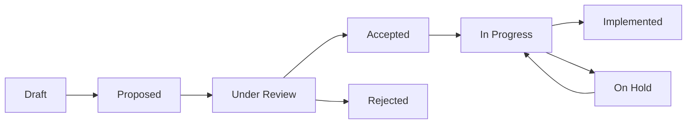

# Feature Proposals

This section contains detailed proposals for new features and enhancements to SynthDB. Each proposal includes motivation, design details, implementation plans, and considerations for future development.

## Current Proposals

### Database Branching

Proposed

**[Database Branching](feature-proposals/database-branching.md)**

Add branching capabilities to SynthDB, allowing users to create isolated copies of database files, perform operations on them, and optionally merge changes back to the main database.

**Key Features:**
- Create isolated database branches for safe experimentation
- Merge changes back to main database with conflict resolution
- Support for different branching strategies (copy, copy-on-write, read-only)
- Git-like workflow for database operations

**Complexity:** High | **Timeline:** 9-13 weeks

---

### Joined Table Queries

Proposed

**[Joined Table Queries](feature-proposals/joined-table-queries.md)**

Add support for joining multiple tables in SynthDB queries, enabling relational queries across the flexible schema-on-write architecture.

**Key Features:**
- Inner, left, right, and outer joins
- Automatic relationship detection and predefined joins
- Join builder pattern for complex queries
- Integration with SynthDB's EAV model

**Complexity:** Medium | **Timeline:** 8-12 weeks

---

### Safe User Query Execution

Proposed

**[Safe User Query Execution](feature-proposals/safe-user-queries.md)**

Add the ability for users to execute custom SQL queries with built-in safety mechanisms that prevent modification of database structure or access to internal tables.

**Key Features:**
- SQL parsing and validation for safety
- Read-only query execution with security controls
- Advanced analytics capabilities (window functions, CTEs)
- Integration with reporting tools and BI systems

**Complexity:** Medium | **Timeline:** 10-14 weeks

---

### Column References and Aliasing

Proposed

**[Column References and Aliasing](feature-proposals/column-references.md)**

Add support for column references that allow multiple column definitions to point to the same underlying data without duplicating storage. Enables efficient schema evolution, data migration, and column aliasing.

**Key Features:**
- Hard, soft, and alias reference modes for different use cases
- Copy-on-write behavior for flexible data independence
- Storage-efficient schema evolution and migration support
- Backward compatibility during column renaming

**Complexity:** Medium | **Timeline:** 8-12 weeks

## Proposal Process

### Submitting a Proposal

1. **Research**: Review existing functionality and similar features in other systems
2. **Template**: Use the [proposal template](proposal-template.md) for consistency
3. **Discussion**: Share with the development team for initial feedback
4. **Refinement**: Iterate on the design based on feedback
5. **Documentation**: Submit complete proposal as a pull request

### Proposal Lifecycle

#### Status Definitions

- **Proposed**: Initial proposal submitted, awaiting review
- **Under Review**: Being evaluated by the development team
- **Accepted**: Approved for implementation, waiting for scheduling
- **In Progress**: Currently being implemented
- **On Hold**: Implementation paused due to dependencies or priorities
- **Implemented**: Feature completed and merged
- **Rejected**: Not approved for implementation

### Evaluation Criteria

Proposals are evaluated based on:

1. **User Value**: Does this solve real user problems?
2. **Technical Feasibility**: Can this be implemented with reasonable effort?
3. **Architectural Fit**: Does this align with SynthDB's design principles?
4. **Maintenance Burden**: What's the long-term maintenance cost?
5. **Breaking Changes**: Does this require breaking changes to existing APIs?
6. **Performance Impact**: How does this affect system performance?

## Implementation Priorities

### High Priority
Features that address core user needs and align with SynthDB's mission:
- Enhanced query capabilities
- Data integrity and safety features
- Performance improvements
- Developer experience enhancements

### Medium Priority
Features that add significant value but are not critical:
- Advanced analytical capabilities
- Integration features
- Workflow improvements
- Specialized use case support

### Low Priority
Features that are nice-to-have but not essential:
- Experimental features
- Niche use cases
- Convenience features
- Cosmetic improvements

## Contributing to Proposals

### For Users
- **Feature Requests**: Submit issues describing features you need
- **Use Cases**: Share real-world scenarios where features would help
- **Feedback**: Comment on existing proposals with your perspective
- **Testing**: Help test proposed features during development

### For Developers
- **Design Reviews**: Participate in proposal discussions
- **Implementation**: Take ownership of approved proposals
- **Prototyping**: Create proof-of-concept implementations
- **Documentation**: Help refine proposal documentation

## Related Documentation

- [Contributing Guide](contributing.md) - How to contribute to SynthDB
- [Architecture Overview](architecture.md) - Understanding SynthDB's design
- [Development Setup](../getting-started/installation.md#development-installation) - Setting up for development

## Questions and Discussion

Have questions about these proposals or ideas for new features?

- **GitHub Discussions**: [Start a discussion](https://github.com/russellromney/synthdb/discussions)
- **Issues**: [Create an issue](https://github.com/russellromney/synthdb/issues/new) for specific feature requests
- **Pull Requests**: Submit proposal documents as pull requests

---

*Last updated: 2024-06-26*